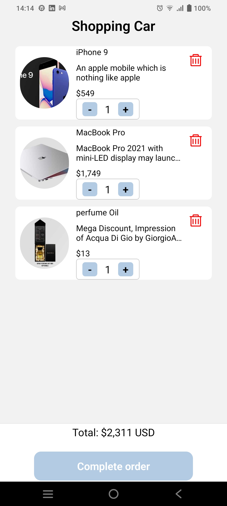

# Kiura shop App

Este proyecto es una aplicación de ecommerce desarrollada con React Native que consume la API de Dummy JSON para obtener datos de productos simulados. La aplicación permite a los usuarios navegar por diferentes categorías de productos, agregar productos al carrito, realizar compras simuladas y ver detalles de los productos.

## Características

- Navegación fluida entre categorías de productos.
- Vista de detalles de producto con información detallada y opciones de compra.
- Carrito de compras donde los usuarios pueden agregar o eliminar productos.
- Calculadora de total de compra en tiempo real.
- Integración con la API de Dummy JSON para obtener datos de productos simulados.

## Capturas de pantalla


*Lista de productos*


*Detalle del producto.*


*Carrito de comprar con los productos agregados.*


*Carrito de comprar vacío.*

## Instalación

1. Clona el repositorio:

```bash
git clone https://github.com/ETBGM03/Kiura-test.git
```


2. Navega al folder

```bash
cd Kiura-tes;
npm install;
```

3. Ejecuta el proyecto, ten en cuenta que es una app hecho con expo por lo que debes instalar Expo Go para poder emular en dispositivo.

```bash
cd Kiura-tes;
npm install;
```


